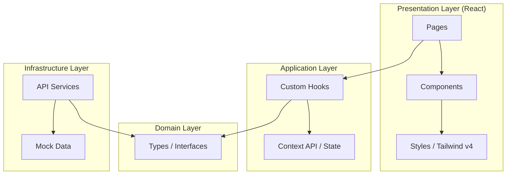
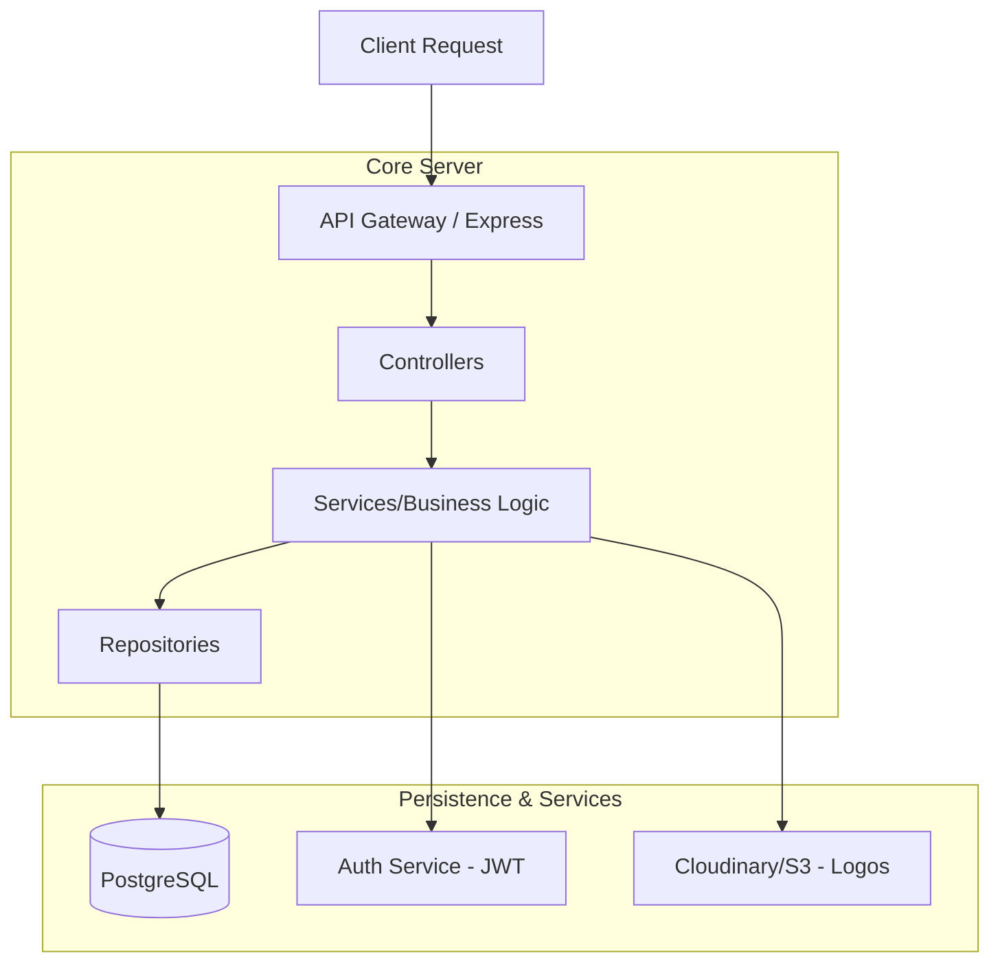

# 🏛️ Eloong Software Architecture

Este documento descreve a arquitetura técnica da plataforma **Eloong**, projetada para escalabilidade, manutenibilidade e alta performance.

---

## 🎨 1. Arquitetura Frontend (Implementada)

O frontend segue os princípios da **Clean Architecture**, separando a lógica de negócio da interface do usuário.

### Tecnologias:
- **React 19**: Biblioteca base para UI.
- **Vite**: Build tool ultra-rápida.
- **Tailwind CSS v4**: Estilização baseada em tokens e performance.
- **Lucide React**: Conjunto de ícones consistentes.

---

## ⚙️ 2. Arquitetura Backend (Proposta)

Para o backend, recomendamos uma estrutura **Layered Architecture (N-Tier)** para garantir que as regras de negócio das ONGs e Voluntários sejam processadas de forma segura.

### Detalhes do Backend:
*   **API**: RESTful API usando **Node.js (Express ou NestJS)**.
*   **Autenticação**: **JWT (JSON Web Tokens)** para sessões seguras de Voluntários e ONGs.
*   **Banco de Dados**: **PostgreSQL** para dados relacionais (oportunidades, perfis, candidaturas).
*   **Cache**: **Redis** para busca rápida de oportunidades geolocalizadas.

---

## ☁️ 3. Infraestrutura e Deployment

Para um ambiente de produção real e escalável:

| Componente | Ferramenta Sugerida |
| :--- | :--- |
| **Hospedagem Frontend** | Vercel ou Netlify |
| **Hospedagem Backend** | AWS (EC2/Lambda) ou Heroku |
| **Banco de Dados** | Supabase ou MongoDB Atlas |
| **CI/CD** | GitHub Actions |
| **CDN** | Cloudflare |

---

## 🛡️ 4. Segurança
*   **CORS**: Configurado para aceitar apenas o domínio oficial.
*   **Sanitização**: Proteção contra XSS e SQL Injection em todas as rotas.
*   **Rate Limiting**: Para evitar abusos na criação de oportunidades por ONGs.

---

*Documento gerado para o Hackathon Eloong - 2026*
